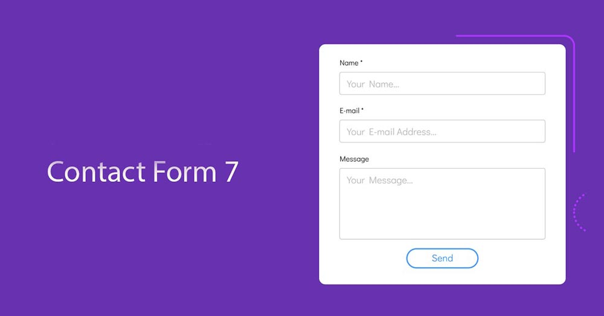

# Thực hành bài học tại Lab

## Task 1

- Tạo form login với 2 trường: user_name, password
theo 2 kiểu horizontal vs vertical
- Bắt buộc nhập, độ dài tối thiểu password là 8 ký tự, của username là 4 kí tự, tối đa là 120 kí tự
- Định dạng form hiển thị đẹp mắt

## Task 2

Tạo form như demo

- name và email bắt buộc nhập, email phải đúng định dạng email, message tối thiểu 8 kí tự