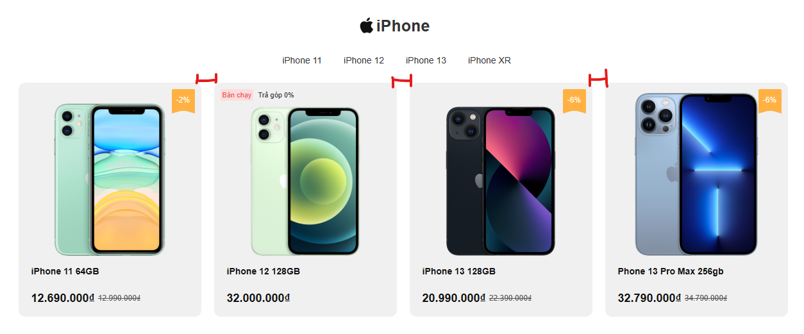

# Session 1- Tổng quan Bootstrap 

> ➡️ 1. Bootstrap là gì?
> 
> ➡️ 2. Tích hợp Bootstrap 5 vào Dự Án
> 
> ➡️ 3. Cấu trúc thư mục Bootstrap 5
> 
> ➡️ 4. Sử dụng Bootstrap 5
> 
> ➡️ 5. Dựng Layout với Bootstrap 5
> 


Tài liệu chính thức: <https://getbootstrap.com/docs/5.3/getting-started/introduction/>

## ⭐ 1. Bootstrap là gì?

**Bootstrap** là một framework mã nguồn mở hoàn toàn miễn phí được phát triển dựa trên các ngôn ngữ: HTML, CSS và Javascript. Với Bootstrap, bạn hoàn toàn có thể phát triển một website với mức độ responsive cao trên nhiều thiết bị khác nhau.

Qua 1 thập kỷ phát triển, phiên bản chính thức mới nhất của Bootstrap tại 1/1/2023 là Bootstrap 5.3. Từ logo, bộ tài liệu hướng dẫn cho đến những nâng cấp khác khiến Bootstrap 5 trở thành một trong những dấu mốc đặc biệt trong lịch sử phát triển của Bootstrap.

😊 Nói một cách đơn giản, Bootstrap là một bộ sưu tập các đoạn code lớn có thể tái sử dụng, được viết bằng HTML, CSS và JavaScript. Bên cạnh đó, đây cũng là framework develop front-end cho phép các developer và designer có thể nhanh chóng xây dựng các trang web responsive. Về cơ bản, framework Bootstrap giúp tiết kiệm thời gian viết CSS, từ đó ta sẽ có nhiều thời gian cho việc thiết kế các trang web hơn. Và hơn hết, nó “HOÀN TOÀN MIỄN PHÍ“.

> **`Bootstrap`** `ví như một bữa tiệc Css Buffet, bạn chỉ việc sử dụng những gì được tạo sẵn.`

**Lịch sử về Bootstrap**

Bootstrap là sản phẩm của **Mark Otto** và **Jacob Thornton** tại Twitter. Tên gọi ban đầu của Bootstrap là **Twitter Blueprint**. Mục đích lúc đầu của nó như một mã nguồn mở vào ngày 19/09/2011 trên GitHub dùng để cải thiện tính nhất quán giữa các công cụ nội bộ.

|Phiên bản|Ngày phát hành|Các thay đổi và nội dung chính|
|:----|:----|:----|
|2.0|31/01/2012|Bổ sung hệ thống Grid-Layout 12 cột. Thêm một số thành phần (component) mới, cũng như thay đổi một vài thành phần sẵn có. Vẫn chưa hỗ trợ Mobile.|
|3.0|19/08/2013|Các thành phần được thiết kế lại theo phong cách thiết kế phẳng (flat design). **Cột mốc quan trọng khi Bootstrap hỗ trợ các thiết bị Mobile.**|
|4.0|19/01/2018|Bootstrap 4 gần như viết lại hoàn toàn từ Bootstrap 3. Phiên bản này được đánh giá là dễ sử dụng hơn rất nhiều so với phiên bản trước.|
|5.0|05/05/2021|Có thêm thành phần off canvas menu và loại bỏ sự phụ thuộc vào jQuery. Thay vào đó, họ chuyển sang [JavaScript Vanilla](https://wiki.tino.org/vanilla-javascript-la-gi/)|


=================================================

## ⭐ 2. Tích hợp Bootstrap 5 vào Dự Án

Tùy vào mã nguồn dự án, sẽ có cách cài đặt tích hợp khác nhau. Trong phạm vi khóa học Html, Css này thì chỉ cần quan tâm đến 2 cách:


Xem chi tiết: <https://getbootstrap.com/docs/5.3/getting-started/download/>

### Cách 1: Tải Compiled CSS and JS

- Tải Bootstrap 5 về và đặt chung trong dự án của bạn.
- Tích hợp vào Bootstrap 5 vào dự án

### Cách 2: CDN Links

Dán vào head global của dự án

```html
<script src="https://cdn.jsdelivr.net/npm/@popperjs/core@2.11.6/dist/umd/popper.min.js" integrity="sha384-oBqDVmMz9ATKxIep9tiCxS/Z9fNfEXiDAYTujMAeBAsjFuCZSmKbSSUnQlmh/jp3" crossorigin="anonymous"></script>
<script src="https://cdn.jsdelivr.net/npm/bootstrap@5.3.0-alpha1/dist/js/bootstrap.min.js" integrity="sha384-mQ93GR66B00ZXjt0YO5KlohRA5SY2XofN4zfuZxLkoj1gXtW8ANNCe9d5Y3eG5eD" crossorigin="anonymous"></script>

```


=================================================

## ⭐ 3. Cấu trúc thư mục Bootstrap 5

Chi tiết xem: <https://getbootstrap.com/docs/5.3/getting-started/contents/>


=================================================

## ⭐ 4. Hỗ trợ trình duyệt

Chi tiết: <https://getbootstrap.com/docs/5.3/getting-started/browsers-devices/>

## ⭐ Sử dụng Bootstrap 5

Từ phiên bản 5, Bootstrap đưa chúng ta tiếp cận theo **8 phần chính**

<https://getbootstrap.com/docs/5.3/getting-started/introduction/>

- **Customize**: tùy biến Bootstrap 5 theo ý muốn.
- **Layout**: Dựng bố cục Layout
- **Content**: Trình bày nội dung
- **Forms**: Dựng giao diện về Form
- **Components**: Các thành phần dựng sẵn bởi Bootstrap
- **Helpers**: Class soạn sẵn để sử dụng
- **Utilities**: Class soạn sẵn để sử dụng
- **Extend**: Thành phần Mở rộng cho Bootstrap như icon Font

Hoặc bạn muốn tiếp cận Bootstrap 5 theo hướng cũ thì có thể tham khảo tài liệu w3School

<https://www.w3schools.com/bootstrap5/index.php>


==========================================

## ⭐ Layout Bootstrap 5


### 🍄 Breakpoints

**Breakpoint** là những điểm (phạm vi giới hạn) mà tại đó nội dung của website sẽ co dãn một cách linh hoạt phụ thuộc vào chiều rộng của thiết bị nhằm đem đến cho người xem một trải nghiệm tuyệt vời và hoàn hảo nhất


#### Core concepts

- Breakpoints là điểm mấu chốt để thiết kế responsive.

- Media queries sử dụng `min-width` là chủ yếu.

- Mobile first

#### Các breakpoints hợp lệ

--------------------------

Bootstrap bao gổm 6 điểm breakpoints mặc định. Bạn có thể tùy chỉnh breakpoints nếu sử dụng với Sass.

Doc: <https://getbootstrap.com/docs/5.2/layout/breakpoints/#available-breakpoints>

### 🍄 Containers

Containers are a fundamental building block of Bootstrap that contain, pad, and align your content within a given device or viewport.

Doc: <https://getbootstrap.com/docs/5.2/layout/containers/>


### 🍄 Grid

==> QUAN TRỌNG NHẤT

==> LINH HỒN CỦA BOOTSTRAP

- Sử dụng Grid 12 cột, với 6 điểm breakpoints với nguyên tắc mobile-first.

- Các cột mặc định hiển thị dạng flexbox

Doc: <https://getbootstrap.com/docs/5.2/layout/grid/>

- Cách sử dụng Grid: Xem Examples


### 🍄 Columns

- Về mặt cách hoạt động thì Grid và Column giống nhau vì đều dựa trên **flexbox grid system** 

- Columns được hiểu nó dùng thay đổi chiều rộng của cột với các TÙY CHỌN như: alignment, ordering, and offsetting.

- Dùng các đặc tính của Flexbox để sử dụng

Ví dụ: <https://getbootstrap.com/docs/5.2/layout/columns/>

### 🍄 Gutters

Gutters là khoảng trống đệm giữa các cột. Xem hình minh họa



Khi chưa có Flexbox thì dùng margin-right để tạo khoảng cách giữa các items.

Trong Flexbox, Grid ta có khái niệm là Gutters để tạo khoảng đệm giữa hàng và cột.

Chi tiết xem: <https://getbootstrap.com/docs/5.2/layout/gutters/>


### 🍄 Css Grid

- Sử dụng đặc tính `display: grid;` để tạo lưới hiển thị.
- Cách sử dụng: tương tự như Gird Flexbox, chỉ khác tên class.

Chi tiết: <https://getbootstrap.com/docs/5.2/layout/css-grid/>

==========================================